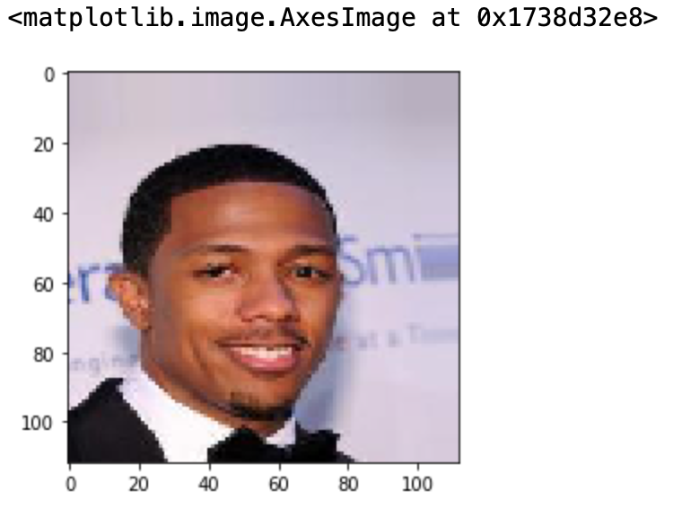
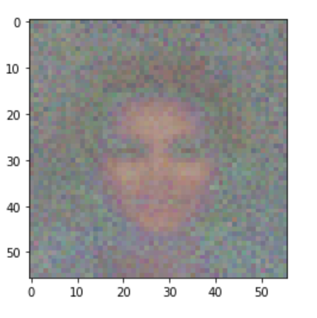

## Abstract

Deepfake is a technique that can superimpose face images of a target person to a video of a source person to create a video of the target person doing or saying things the source person does. Deepfakes use deep learning technology, a branch of machine learning that applies neural net simulation to massive data sets, to create a fake. Deep learning has been successfully applied to solve various complex problems ranging from big data analytics to computer vision and human-level control. Deep learning advances however have also been employed to create software that can cause threats to privacy, democracy and national security. One feature of Deep neural network is Auto Encoders, which is basically used for image reduction. Usually, the autoencoder extracts latent features of face images and the decoder is used to reconstruct the face images. A deepfake creation model using two encoder-decoder pairs. Two networks use the same encoder but different decoders for training process . An image of face A is encoded with the common encoder and decoded with decoder B to create a deepfake. Now that we know a Brief, In our project we would detecting deepfakes of various forms namely, Facial manipulation, Synthesis and Attribute Manipulation. Current facial manipulation methods can be separated into two categories: facial expression manipulation and facial identity manipulation. And the above methods would be perfomed on a dataset that contains a hidden test set as well as a database of over 1.8 million manipulated images. We show that the use of additional domain specific knowledge improves the detection to an expected accuracy, even in the presence of strong compression, and clearly outperforms human observers.

## Introduction

Human beings have always inclined towards art and it can be seen in the form of early cave paintings, to elaborate sculptures and ultra-realistic paintings. As technology improved, we moved onto the very first cameras and to motion pictures.  With the advent of widespread digital computing and digital imaging system, we started working on images and videos on computers. As a consequence, many methods of digital image processing and manipulation techniques were born. On comes machine learning and artificial intelligence into the picture. Now we have more power than ever to create and manipulate images and videos. Technologies like GANs (Generative Adversarial Networks) and AutoEncoders enable users to swap faces, change attributes and generate entirely new faces that do not exist at all. This method is popularly known as DeepFake and is a very innovative and interesting process. 

However, this impressive technology can cause a lot of harm in the wrong hands. Social engineering, phishing, identity theft, circulation of fake news, radical politics and invasion of individual privacy are just a few examples of nefarious activities that can be carried out with the help of deepfakes. Thus, it is imperative that we devise methods to confirm the authenticity of an image or video, i.e. to determine if the image/video is real or generated by AI. In this project, we aim to use Al to check the authenticity of an image/video as it is impossible for humans to differentiate with their bare eyes.

## Scope
 
Deepfake refers to the misuse of AI technology, that allows individuals to create highly realistic fake, or altered videos, images and audio files. Moreover, advancement in technology has made it increasingly difficult to tell apart fakes from real media. Especially the existence of hyper-realistic videos that use AI to show a person doing or saying something that never actually happened. This can and has been exploited in multiple ways to impact society negatively.
Deepfakes are a major threat to our society, political system, and business because they 1) put pressure on journalists struggling to filter real from fake news, 2) threaten national security by disseminating propaganda and interfering in elections, 3) hamper citizen trust toward information by authorities, and, 4) raise cybersecurity issues for people and organizations. Could even be used to start wars between countries, affect election campaigns, spread fake news, and fool the public. Ultimately, disrupting the harmony of the world.

There are of course, positive impacts of this technology as well such as creating videos of those who’ve lost someone close to them or updating movies without having to shoot them again. However, the harmful and malicious uses of this technology are more prevalent over the positive ones.
Moreover, advanced neural networks have made this technology simpler sometimes, even requiring just as much as a single image to generate fakes and more accessible to the general public. This means that not only celebrities and politicians but even ordinary citizens are at risk.
Even more alarming is the existence of revenge porn, which utilizes this technology for the purpose of superimposing images of targeted women to create fake sexually explicit videos which are then passed around to inflict lasting damage on a woman’s reputation.

Although, most deepfakes are created for harmless fun or artistic works. There is a darker side to this. In the political scene, a 2018 deepfake created by Hollywood filmmaker Jordan Peele featured former US President Obama discussing the dangers of fake news and mocking the current president Trump. In a 2018 deepfake video, Donald Trump offered advice to the people of Belgium about climate change. The video was created by a Belgian political party “sp.a” in order to attract people to sign an online petition calling on the Belgian government to take more urgent climate action. In 2019, the U.S. Democratic Party deepfaked its own chairman Tom Perez to highlight the potential threat of deepfakes to the 2020 election. Even non-political people have been used to create these deepfakes. In June 2019, a high-quality deepfake by two British artists featuring Facebook CEO Mark Zuckerberg racked up millions of views (CBS01). The video falsely portrays Zuckerberg giving respect to Spectre, a fictional evil organization from the James Bond series that teaches him how to take total control of billions of peoples’ confidential data, and thus own their future. Therefore, combating this issue is an urgent issue and must be looked into immediately.

## Sections 

## 1.1 Currency denomination and Fake Currency Detection
Technology is growing in no time lately. Consequently, the banking sector is additionally obtaining modern-day by day. This brings a deep would like of automatic faux currency detection in the machine and automatic product merchant machine. several researchers are inspired to develop strong and economical automatic currency detection machine. The proposed system gives an approach to verify the Indian currency notes. Verification of currency note is done by the concepts of image processing. Apart from Image acquisition the two main aspects of the system is feature extraction and detection.
1.	Acquisition: Acquisition of image is a method of making digital pictures, from a physical scene. Here, the image is captured by a straightforward camera specified all the options are highlighted. Image is then hold on for the additional process.
2.	Feature extraction :  Sometimes too much information can reduce the effectiveness of data mining. Some of the columns of data attributes assembled for building and testing a model may not contribute meaningful information to the model. Some may actually detract from the quality and accuracy of the model. Feature extraction is a process of dimensionality reduction by which an initial set of raw data is reduced to more manageable groups for processing.  Feature extraction is the name for methods that select and /or combine variables into features, effectively reducing the amount of data that must be processed, while still accurately and completely describing the original data set. There are many algorithms for feature extraction, most popular of them are SURF, ORB, SIFT, BRIEF. Most of these algorithms based on image gradient. The method that we would be using for our project is: ORB. This is a one shot facial recognition algorithm. ORB is preferred over most Algorithms and it is said to be a more efficient algorithm compared to as compared to SIFT and SURF. ORB is widely used due to its ability of being rotational and scale invariant. Also ORB being not patented also makes it feasible for our project. 
Distinctive Features:
•	Key Point Matching.
•	Corners 
•	Binary vectors
3.	Detection: Detection of the denominations are done by feature extraction/ image processing completely. For the fake currency detection I deployed deep learning techniques for the task of identifying fake currency notes, using the VGG-16 deep convolutional neural network model. Noted on how deep convolutional neural networks can work as feature extractors and thus no image processing techniques need to be applied to manually find the presence of security features in a note. 
The generated data-set did not represent the real-world scenario of fake currency notes. Under the availability of a real data-set, the deep neural networks can be better trained.

#### Links for the Tried Code: 
https://colab.research.google.com/drive/1_puYe0GlhYsFTnvjSh-sdY0Fw63gE3ga?usp=sharing 
https://colab.research.google.com/drive/1nhhAkU59mpNsYOATNjXniaZhRerDwO8V?usp=sharing
https://colab.research.google.com/drive/12SvGrNdPVKl0wwFRpnDs1nIfvsyb_E6z?usp=sharing 
https://colab.research.google.com/drive/1YvS_hb5TYibhzjLRBmujKCueC7Q6O6Ha?usp=sharing 

## 1.2 DeepFake Detection

With the advancement in image processing techniques and with the integration of machine learning and deep learning techniques into the image processing domain, it has become easier than ever to manipulate images. One could synthesise entirely unseen faces with the help of a technology known as GANs (Generative Adversarial Networks).  This method is popularly known as DeepFakes. The results are breathtakingly realistic, to the point that humans cannot distinguish the fakes from the original images with bare eyes. There are many uses for this technology, for instance in the video game and 3D-Modelling industries. However, this could be used for creating fake social media profiles to carry out phishing activities or generate misinformation. 

GANs are networks that are trained to learn a dataset’s probability distribution from the result of the competition between the two neural networks, Generator and Discriminator. This forms a double feedback loop with the discriminator getting trained to distinguish between the real and the fake and the generator being trained to outdo the performance of the discriminator and generating images that the discriminator cannot distinguish as fake. Firstly, we need to understand what are generative and discriminative models. Unsupervised learning is a type of machine learning which is used to draw inferences and look for undetected patterns in the given dataset with no labelled responses given to the learning algorithm. Generative models belong to this branch of machine learning. Discriminative models belong to the supervised machine learning models which make predictions by understanding the input-output pattern of the original dataset.

### Generative model

This incorporates the joint probability of x and y. In generative models, given some training dataset, we have to create a system that will generate new data. In order to do this, the training data is represented as some kind of distribution. Once we get the range of this distribution, we can obtain some points on it which do not belong to the original dataset i.e. we obtain newly generated datapoints which seem very similar to the original data. Basically, we can obtain new data if we understand the distribution of the existing data. However, the generative model requires a lot of data and takes longer to train.

### Discriminative model

This incorporates the probability of y given x. It finds the probability of a label, given the inputs. The basic objective of this model, as the name suggests is to discriminate or differentiate between two labels. It is easy to model and is used only to classify the data or label the data i.e. it is a binary classifier. This model learns the boundaries between classes. GANs or Generative Adversarial Networks are one of the most commonly used approaches for the generation of data. In a GAN the main objective to achieve an equilibrium between the generator network and the discriminator network.

## 1.3 Face Swapping 

Another creative exploitation of image processing is the creation of photo-realistic face-swapped images. Here, one a source image is swapped onto a target image. Several image processing techniques are used to generate realistic results taking into account the size, expression and tone differences that may exist in the two images. 

This project is going to involve two different phases:

#### Face Swapping involves several steps such as:
1. A face detector is applied to narrow down the facial region of interest(ROI). 
2. Then, the head position and the facial landmarks are used to build a perspective model.
3. Adjustments are made to fit the source image into the target area using an algorithm.
4. Blending is applied that fuses the source face into the target area.

### Concepts Used 

####  Facial Landmark Detection

Facial feature detection is also referred to as “facial landmark detection” or “facial keypoint detection”. Facial keypoints refer to salient features of a face. These are used whenever more information is required about the face such as facial expression, the angle of the face and so on. It has certain highly useful applications. For example it can be used to align the facial images to a mean face shape, so that the location of the facial landmarks in all the images is approximately the same. This helps because face recognition algorithms trained with aligned images perform better as has been both proven by several research papers. Landmark points also enable us to estimate the pose of the head and can consequently be used in drowsiness-detection applications. 

Here, it has been used because the geometry of the two faces may be different and so we might be required to warp the source face a bit to fit onto the target face. 

This is done here using dlib which is a library containing pre-trained models of Image Processing, Machine Learning in C++ and Python. I use this because of its fast and highly accurate. There are however, several other alternatives to it such as Face++, CLM framwork and Haar Cascades of OpenCV. Dlib's facial landmark detector gives us 68 landmark points. 

#### Delaunay Triangulation and Voronoi Diagram

Given a set of points in a plane, a triangulation refers to the subdivision of the plane into triangles, with the points as vertices. 

A set of points can have many possible triangulations, but Delaunay triangulation stands out because of its certain properties. In Delaunay triangulation, triangles are chosen such that no point is inside the circumcircle of any triangle. It does not favor "thin triangles", that is triangles with one large angle.

Voronoi Diagram of a set of points is the mathematical dual to its Delaunay triangulation. Given a set of points in a plane, the Voronoi diagram partitions the space such that the boundary lines are equidistant from neighboring points. Connecting the points in neighboring Voronoi regions, gives the Delaunay triangulation.

####  Triangle Morphing

Image morphing creates an image between two images, I and J by blending the images using a controlled parameter, alpha. Alpha can take values between 0 to 1 such that when it is 0 we get I and when it is 1, we get J. 

This equation is to be applied at every pixel:
M(x,y)=(1-alpha) I(x,y) + alpha J(x,y)

However, thsi does not give us a result as expected. We should first align the faces before performing blending. That is use pixel correspondence. To intelligently blend, the two images, we pick corresponding triangles from the two images, calculate the affine tranform that maps the three corners of one triangle to the three corners of another triangle. In OpenCv it is done using the getAffineTransform. Then, the triangles from the source image are warped using the warpAffine function. This function is designed to take in an image and not a triangle and so, we are required to create a bounding box for it and then mask the pixels outside. The mask is created a function, fillConvexPoly. 

#### Seamless Cloning 

Seamless Cloning allows us to take an object from one image and place it into another but seamlessly. That is, it looks natural. OpenCV has two modes of seamless cloning, NORMAL and MIXED. Mixed gives better results because it ratains teh texture of the image the object is placed upon. Therefore, we'll be going with that here.

### Link for the Colab file:
https://colab.research.google.com/drive/1daNzi_whfKj83IEM-_Hg2p0RJKNnvyQ5?usp=sharing

## 1.4 Attribute Manipulation

The popular technique seen to be used for attribute manipulation is GAN. Therefore our strategy to detect these types of fakes is to create a system that can learn from the GAN generation process. For this, instead of doing usual classification task, we train a discriminator to do the task. This enables our system to have a greater insight into how the fakes are produced, and thereby gives a better chance at predicting correctly.

We use the CelebA dataset that contains pictures of celebrity faces. What is below is a sample image of resolution 112x112. The images are converted to lower resolution due to the fact that computational complexity increses very quickly with the resolution.

We use 4096 images of celebrities to train our discriminator. Below is an image generated by the generator part of our model after having been trained with the images.

 

## Method 

## 1. Exploratory Analysis (EDA)

In order to detect deepfake images it is imperative that we understand how these images are created. Analyzing the working and techniques behind the generation of these images will help in effectively distinguishing fake images from real. DeepFake is created using generative models in deep learning to manipulate the original images to change certain attributes in the image that can make the resultant image misleading. The features can also be tweaked to such an extent that an unrecognizable fake image is created. Autoencoder is an unsupervised artificial neural network that is trained to reconstruct data as close to the original from the encoded compressed data. It consists of two main parts, an encoder that compresses the input data into an encoded format and a decoder that reconstructs data from the encoded representation. Some of its applications include anomaly detection, image denoising, image retrieval. Generative models are a very important application of Autoencoders that we will be using.

Generative Adversarial Networks or GAN, as the name suggests is a member of the generative models that discovers patterns in input data and generates new data instances resembling the original data. GAN uses two competing neural networks - generator and discriminator, to create new images (fake images of non-existent people) with realistic features which cannot be easily recognized by the human eye. The generator is trained to produce an output that the discriminator cannot distinguish from the real, while the discriminator keeps learning to distinguish true data from the generated output. As a result of the two components trying to outdo each other, we obtain near-real fake images. In the exploratory analysis, we will carry out an in-depth study of the working of autoencoders, more specifically GANs in creating deepfake images so that we can potentially reverse engineer discerning features and train our model accordingly.

## 2.1. Feature Engineering 

Engineering features is an important part of making a model better at detecting fake images. Not all features of an image will necessary contribute meaningful information to the model. For this reason we have to separate those features that are "good" from those which are not. The first part of this process is extracting features, which will be discussed shortly. In essence it is the name for methods that select and /or combine variables into features, effectively reducing the amount of data that must be processed, while still accurately and completely describing the original data set. We take this to a step further. As a next step we classify the extracted features so that we can determine which classes of features are good for our use. For this we do prediction using selected classes of features and compare the outomes. After we have ascertained feature importance, we can use the result to select features from our training images to train our model. In fact we can combine these with other inputs which we give to our neural network model.

## 2.2. Feature Extraction

There are many algorithms for feature extraction, most popular of them are SURF, ORB, SIFT, BRIEF. Most of these algorithms based on image gradient. The method that we would be using for our project is: ORB. This is a one shot facial recognition algorithm. ORB is preferred over most Algorithms and it is said to be a more efficient algorithm compared to as compared to SIFT and SURF. ORB is widely used due to its ability of being rotational and scale invariant. Also ORB being not patented also makes it feasible for our project.

ORB is an acronym for Oriented FAST and Rotated BRIEF algorithms. It is actually a sharp combination of FAST and BRIEF(But this is a modified version of BREIF: RBRIEF). ORB essentially finds the “corners” of the image. The FAST component identifies features as areas of the image with a sharp contrast of brightness. The BRIEF component essentially expresses the detected features. BRIEF does this by converting the extracted points as binary feature vectors. These are strings of 128–5260s and 1s.

ORB is considered to be more accurate than SURF(uses 16 pixels) and other algorithms as ORB extracts features based on 4 surrounding pixels. ORB performs as well as SIFT on the task of feature detection (and is better than SURF) while being almost two orders of magnitude faster. It gives good performance with low cost. In ORB we also use sub sampling where every image is down sampled and up sampled accordingly. As mentioned earlier it is rotational and scale invariant, and the algorithm is computationally inexpensive. For image extraction features, it is more stable and has higher anti-interference. We’ll then use a more efficient algorithm to eliminate the effects of extraneous features and further improve the matching speed.

In ORB we also use sub sampling where every image is down sampled and up sampled accordingly. As mentioned earlier it is rotational and scale invariant, and the algorithm is computationally inexpensive. For image extraction features, it is more stable and has higher anti-interference. We’ll then use a more efficient algorithm to eliminate the effects of extraneous features and further improve the matching speed.

## 2.3. Face Extraction

Faces are important features we want to use for our detection of deepfake since most of the deepfakes are made by modifying or switching faces. Face Extraction is one method among many methods for processing images. At first, Face detection is performed using a classifier which is trained on an image dataset consisting of thousands of images with and without faces. The classifier uses the concept of Haar Cascade which is an object detection method used to locate an object of interest in images. The algorithm is trained on a large number of positive and negative samples. Here, the positive samples are those images with faces present and the negative samples are those images without faces present. Once trained, the classifier can then be able to locate the presence of a face(s) for a given image. Once the faces are detected, they are then extracted and saved locally for further analysis.

## 3. Modeling 

Everything leads up to modeling, where we build a deep neural netwrok model which is made with a consideration for all the information we obtained from EDA and uses features we engineered. The model contains convolutional neural network (CNN) layers which, by training, essentially learns to extract information that will contribute to the detection of the image being fake. After the CNN, the inputs will be passed through a fully connected layer (or multiple layers of this sort, depending on the architecture) which gives an estimate of the probability of the image being deepfake.

We can further modify the architecture of the model by tuning the hyperparameters, with a consideration for both accuracy and computaional complexity, to find the best model architecture which suits our need. Some things we can do are to add dropout layers, change the number of nodes in the layers, change the number of layers, change the learning rate of the model, and to try different optimizers. Neural networks provide us with a vast set of modeling possibilities. We can also experiment with different set of features (see 2.1) to perfect our detection.

## Roles of collaborators

1. Aditya, Lalita: DeepFake Detection
2. Neha: Currency denomination and Fake Currency Detection
3. Saran, Bevin: Attribute manipulation and Expression Swap
4. Akshita: Face Swapping 
5. Aditya: Project Manager
